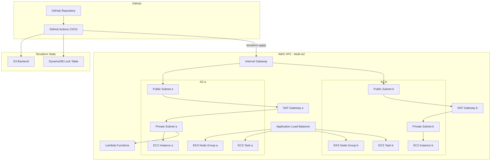
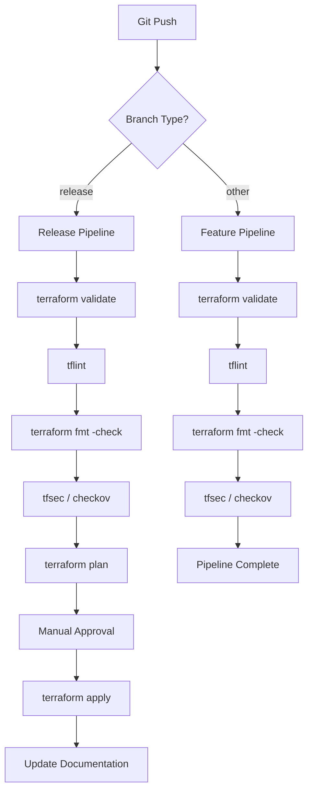
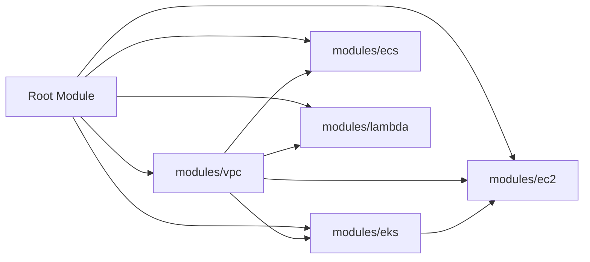
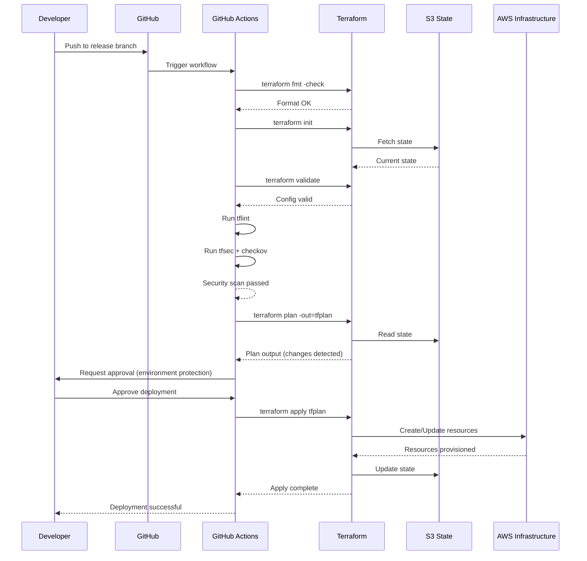
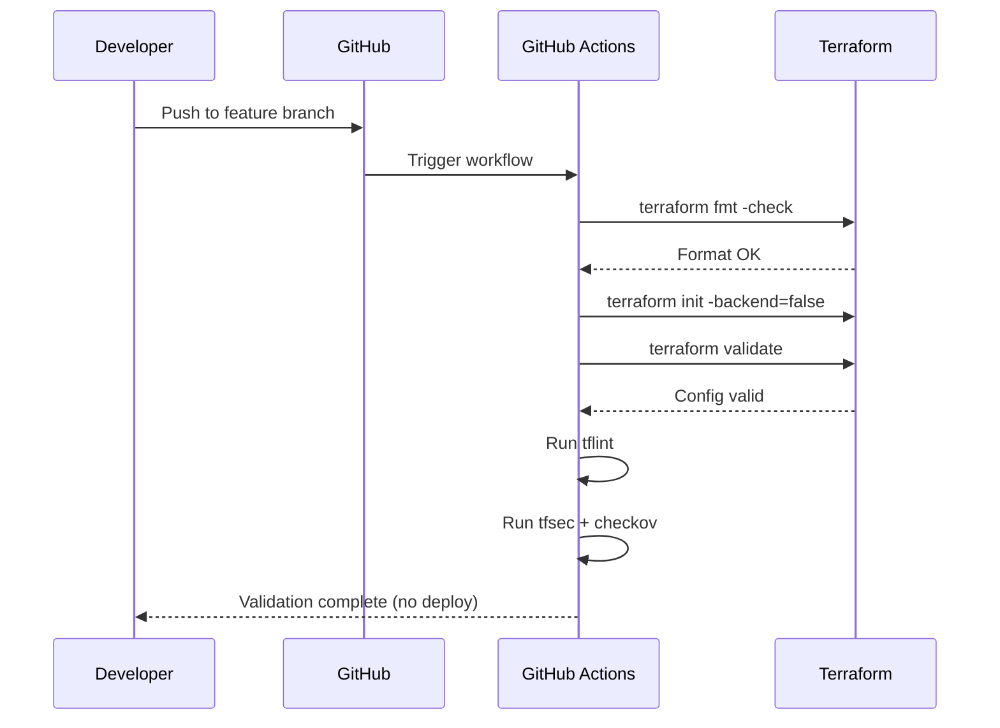

# Design Document: AIOps Infrastructure Deployment

## Overview

This design covers an AIOps demo application that provisions and manages multi-service AWS infrastructure using Terraform. The infrastructure spans EKS, EC2, ECS, and Lambda — all deployed under a shared VPC distributed across multiple Availability Zones for high availability. A GitHub Actions CI/CD pipeline automates validation, linting, security scanning, and conditional deployment based on branch strategy. Steering files and hooks ensure documentation remains synchronized with infrastructure code changes automatically.

The project follows a modular Terraform architecture where each AWS service is encapsulated in its own module, sharing a common networking foundation (VPC, subnets, security groups). The CI/CD pipeline enforces quality gates on all branches while restricting actual deployments to the release branch only. Self-maintaining documentation is achieved through Kiro steering files and hooks that trigger documentation regeneration whenever infrastructure code changes.

## Architecture

### High-Level System Architecture



### CI/CD Pipeline Flow



### Terraform Module Dependency Graph




## Components and Interfaces

### Component 1: VPC Module (`modules/vpc`)

**Purpose**: Provisions the shared VPC, subnets (public and private across AZs), internet gateway, NAT gateways, and route tables that all other services depend on.

**Interface**:
```hcl
# modules/vpc/variables.tf
variable "project_name" {
  type        = string
  description = "Project name used for resource naming and tagging"
}

variable "vpc_cidr" {
  type        = string
  description = "CIDR block for the VPC"
  default     = "10.0.0.0/16"
}

variable "availability_zones" {
  type        = list(string)
  description = "List of AZs to distribute resources across"
  default     = ["us-east-1a", "us-east-1b"]
}

variable "public_subnet_cidrs" {
  type        = list(string)
  description = "CIDR blocks for public subnets (one per AZ)"
  default     = ["10.0.1.0/24", "10.0.2.0/24"]
}

variable "private_subnet_cidrs" {
  type        = list(string)
  description = "CIDR blocks for private subnets (one per AZ)"
  default     = ["10.0.10.0/24", "10.0.20.0/24"]
}

variable "tags" {
  type        = map(string)
  description = "Common tags applied to all resources"
  default     = {}
}
```

```hcl
# modules/vpc/outputs.tf
output "vpc_id" {
  description = "ID of the created VPC"
  value       = aws_vpc.main.id
}

output "public_subnet_ids" {
  description = "List of public subnet IDs"
  value       = aws_subnet.public[*].id
}

output "private_subnet_ids" {
  description = "List of private subnet IDs"
  value       = aws_subnet.private[*].id
}

output "nat_gateway_ids" {
  description = "List of NAT Gateway IDs"
  value       = aws_nat_gateway.main[*].id
}
```

**Responsibilities**:
- Create VPC with DNS support enabled
- Create public and private subnets across specified AZs
- Provision internet gateway for public subnets
- Provision NAT gateways (one per AZ) for private subnet egress
- Configure route tables for public and private subnets
- Apply consistent tagging across all networking resources

---

### Component 2: EKS Module (`modules/eks`)

**Purpose**: Provisions an EKS cluster with managed node groups distributed across AZs within the shared VPC.

**Interface**:
```hcl
# modules/eks/variables.tf
variable "project_name" {
  type        = string
  description = "Project name for resource naming"
}

variable "vpc_id" {
  type        = string
  description = "VPC ID from the VPC module"
}

variable "private_subnet_ids" {
  type        = list(string)
  description = "Private subnet IDs for EKS node groups"
}

variable "cluster_version" {
  type        = string
  description = "Kubernetes version for the EKS cluster"
  default     = "1.29"
}

variable "node_instance_types" {
  type        = list(string)
  description = "EC2 instance types for EKS managed node group"
  default     = ["t3.medium"]
}

variable "node_desired_size" {
  type        = number
  description = "Desired number of nodes in the node group"
  default     = 2
}

variable "node_min_size" {
  type        = number
  description = "Minimum number of nodes"
  default     = 1
}

variable "node_max_size" {
  type        = number
  description = "Maximum number of nodes"
  default     = 4
}

variable "tags" {
  type        = map(string)
  default     = {}
}
```

```hcl
# modules/eks/outputs.tf
output "cluster_endpoint" {
  description = "EKS cluster API endpoint"
  value       = aws_eks_cluster.main.endpoint
}

output "cluster_name" {
  description = "EKS cluster name"
  value       = aws_eks_cluster.main.name
}

output "cluster_security_group_id" {
  description = "Security group ID attached to the EKS cluster"
  value       = aws_eks_cluster.main.vpc_config[0].cluster_security_group_id
}

output "node_group_role_arn" {
  description = "IAM role ARN for the EKS node group"
  value       = aws_iam_role.eks_node_group.arn
}
```

**Responsibilities**:
- Create EKS cluster with specified Kubernetes version
- Create IAM roles for cluster and node groups (least-privilege)
- Provision managed node group across private subnets
- Configure cluster security group rules
- Enable cluster logging (audit, api, authenticator)

---

### Component 3: EC2 Module (`modules/ec2`)

**Purpose**: Provisions EC2 instances across AZs for workloads that require direct VM access.

**Interface**:
```hcl
# modules/ec2/variables.tf
variable "project_name" {
  type        = string
  description = "Project name for resource naming"
}

variable "vpc_id" {
  type        = string
  description = "VPC ID from the VPC module"
}

variable "private_subnet_ids" {
  type        = list(string)
  description = "Private subnet IDs for EC2 placement"
}

variable "instance_type" {
  type        = string
  description = "EC2 instance type"
  default     = "t3.micro"
}

variable "instance_count" {
  type        = number
  description = "Number of EC2 instances (distributed across AZs)"
  default     = 2
}

variable "ami_id" {
  type        = string
  description = "AMI ID for the EC2 instances"
}

variable "key_name" {
  type        = string
  description = "SSH key pair name"
  default     = ""
}

variable "tags" {
  type        = map(string)
  default     = {}
}
```

```hcl
# modules/ec2/outputs.tf
output "instance_ids" {
  description = "List of EC2 instance IDs"
  value       = aws_instance.main[*].id
}

output "private_ips" {
  description = "List of private IP addresses"
  value       = aws_instance.main[*].private_ip
}

output "security_group_id" {
  description = "Security group ID for EC2 instances"
  value       = aws_security_group.ec2.id
}
```

**Responsibilities**:
- Create EC2 instances distributed across private subnets
- Configure security groups with minimal required access
- Attach IAM instance profile for AWS API access
- Configure user data scripts for instance bootstrapping

---

### Component 4: ECS Module (`modules/ecs`)

**Purpose**: Provisions an ECS cluster with Fargate tasks distributed across AZs.

**Interface**:
```hcl
# modules/ecs/variables.tf
variable "project_name" {
  type        = string
  description = "Project name for resource naming"
}

variable "vpc_id" {
  type        = string
  description = "VPC ID from the VPC module"
}

variable "private_subnet_ids" {
  type        = list(string)
  description = "Private subnet IDs for ECS tasks"
}

variable "public_subnet_ids" {
  type        = list(string)
  description = "Public subnet IDs for the ALB"
}

variable "container_image" {
  type        = string
  description = "Docker image for the ECS task"
  default     = "nginx:latest"
}

variable "container_port" {
  type        = number
  description = "Port the container listens on"
  default     = 80
}

variable "task_cpu" {
  type        = number
  description = "CPU units for the Fargate task"
  default     = 256
}

variable "task_memory" {
  type        = number
  description = "Memory (MiB) for the Fargate task"
  default     = 512
}

variable "desired_count" {
  type        = number
  description = "Desired number of ECS tasks"
  default     = 2
}

variable "tags" {
  type        = map(string)
  default     = {}
}
```

```hcl
# modules/ecs/outputs.tf
output "cluster_id" {
  description = "ECS cluster ID"
  value       = aws_ecs_cluster.main.id
}

output "service_name" {
  description = "ECS service name"
  value       = aws_ecs_service.main.name
}

output "alb_dns_name" {
  description = "DNS name of the Application Load Balancer"
  value       = aws_lb.main.dns_name
}

output "task_definition_arn" {
  description = "ARN of the ECS task definition"
  value       = aws_ecs_task_definition.main.arn
}
```

**Responsibilities**:
- Create ECS cluster with Fargate capacity provider
- Define task definitions with container configurations
- Create ECS service with cross-AZ task distribution
- Provision ALB with target group and health checks
- Configure security groups for ALB and tasks
- Set up CloudWatch log groups for container logs

---

### Component 5: Lambda Module (`modules/lambda`)

**Purpose**: Provisions Lambda functions within the VPC for event-driven workloads.

**Interface**:
```hcl
# modules/lambda/variables.tf
variable "project_name" {
  type        = string
  description = "Project name for resource naming"
}

variable "vpc_id" {
  type        = string
  description = "VPC ID from the VPC module"
}

variable "private_subnet_ids" {
  type        = list(string)
  description = "Private subnet IDs for VPC-attached Lambda"
}

variable "function_name" {
  type        = string
  description = "Name of the Lambda function"
}

variable "runtime" {
  type        = string
  description = "Lambda runtime"
  default     = "python3.12"
}

variable "handler" {
  type        = string
  description = "Lambda handler"
  default     = "main.handler"
}

variable "memory_size" {
  type        = number
  description = "Memory allocation in MB"
  default     = 128
}

variable "timeout" {
  type        = number
  description = "Function timeout in seconds"
  default     = 30
}

variable "environment_variables" {
  type        = map(string)
  description = "Environment variables for the Lambda function"
  default     = {}
}

variable "tags" {
  type        = map(string)
  default     = {}
}
```

```hcl
# modules/lambda/outputs.tf
output "function_arn" {
  description = "ARN of the Lambda function"
  value       = aws_lambda_function.main.arn
}

output "function_name" {
  description = "Name of the Lambda function"
  value       = aws_lambda_function.main.function_name
}

output "invoke_arn" {
  description = "Invoke ARN for API Gateway integration"
  value       = aws_lambda_function.main.invoke_arn
}

output "security_group_id" {
  description = "Security group ID for the Lambda function"
  value       = aws_security_group.lambda.id
}
```

**Responsibilities**:
- Create Lambda function with VPC configuration
- Configure IAM execution role with least-privilege policies
- Attach function to private subnets across AZs
- Configure security group for VPC network access
- Set up CloudWatch log group with retention policy


## Data Models

### Model 1: Root Module Configuration

```hcl
# environments/dev/terraform.tfvars
project_name       = "aiops-demo"
aws_region         = "us-east-1"
availability_zones = ["us-east-1a", "us-east-1b"]

# VPC
vpc_cidr             = "10.0.0.0/16"
public_subnet_cidrs  = ["10.0.1.0/24", "10.0.2.0/24"]
private_subnet_cidrs = ["10.0.10.0/24", "10.0.20.0/24"]

# EKS
eks_cluster_version    = "1.29"
eks_node_instance_types = ["t3.medium"]
eks_node_desired_size  = 2
eks_node_min_size      = 1
eks_node_max_size      = 4

# EC2
ec2_instance_type  = "t3.micro"
ec2_instance_count = 2

# ECS
ecs_container_image = "nginx:latest"
ecs_container_port  = 80
ecs_task_cpu        = 256
ecs_task_memory     = 512
ecs_desired_count   = 2

# Lambda
lambda_runtime     = "python3.12"
lambda_memory_size = 128
lambda_timeout     = 30

# Common tags
tags = {
  Environment = "dev"
  Project     = "aiops-demo"
  ManagedBy   = "terraform"
}
```

**Validation Rules**:
- `vpc_cidr` must be a valid CIDR block with mask between /16 and /24
- `availability_zones` must contain at least 2 AZs in the same region
- `public_subnet_cidrs` and `private_subnet_cidrs` must have the same length as `availability_zones`
- All subnet CIDRs must fall within the `vpc_cidr` range
- `eks_node_min_size` must be less than or equal to `eks_node_desired_size`
- `eks_node_desired_size` must be less than or equal to `eks_node_max_size`
- `ec2_instance_count` must be greater than 0
- `ecs_desired_count` must be greater than 0
- `lambda_timeout` must be between 1 and 900

### Model 2: Terraform Backend Configuration

```hcl
# backend.tf
terraform {
  backend "s3" {
    bucket         = "aiops-demo-terraform-state"
    key            = "infrastructure/terraform.tfstate"
    region         = "us-east-1"
    dynamodb_table = "aiops-demo-terraform-locks"
    encrypt        = true
  }
}
```

**Validation Rules**:
- S3 bucket must exist and have versioning enabled
- DynamoDB table must exist with `LockID` as partition key
- Encryption must always be enabled for state files
- State file key must be unique per environment

### Model 3: Provider Configuration

```hcl
# providers.tf
terraform {
  required_version = ">= 1.7.0"

  required_providers {
    aws = {
      source  = "hashicorp/aws"
      version = "~> 5.0"
    }
  }
}

provider "aws" {
  region = var.aws_region

  default_tags {
    tags = var.tags
  }
}
```

**Validation Rules**:
- Terraform version must be >= 1.7.0
- AWS provider version must be pinned to major version (~> 5.0)
- Region must be a valid AWS region string
- Default tags must always include `Environment`, `Project`, and `ManagedBy`

## Algorithmic Pseudocode

### Main Processing Algorithm: CI/CD Pipeline Execution

```pascal
ALGORITHM executePipeline(event)
INPUT: event containing branch_name, commit_sha, repository
OUTPUT: pipeline_result (success or failure with details)

BEGIN
  // Step 1: Determine pipeline type based on branch
  IF event.branch_name = "release" THEN
    pipeline_type ← FULL_DEPLOY
  ELSE
    pipeline_type ← VALIDATE_ONLY
  END IF

  // Step 2: Initialize Terraform
  result ← terraformInit(event.repository)
  IF result.status ≠ SUCCESS THEN
    RETURN PipelineResult(FAILURE, "Init failed", result.error)
  END IF

  // Step 3: Format check
  result ← terraformFmtCheck(event.repository)
  IF result.status ≠ SUCCESS THEN
    RETURN PipelineResult(FAILURE, "Format check failed", result.diff)
  END IF

  // Step 4: Validate configuration
  result ← terraformValidate(event.repository)
  IF result.status ≠ SUCCESS THEN
    RETURN PipelineResult(FAILURE, "Validation failed", result.errors)
  END IF

  // Step 5: Lint with tflint
  result ← tflintRun(event.repository)
  IF result.status ≠ SUCCESS THEN
    RETURN PipelineResult(FAILURE, "Lint failed", result.warnings)
  END IF

  // Step 6: Security scan
  result ← securityScan(event.repository)
  IF result.has_critical_findings THEN
    RETURN PipelineResult(FAILURE, "Security scan failed", result.findings)
  END IF

  // Step 7: Deploy only for release branch
  IF pipeline_type = FULL_DEPLOY THEN
    plan_result ← terraformPlan(event.repository)
    IF plan_result.has_changes THEN
      approval ← waitForApproval(plan_result.plan_output)
      IF approval.approved THEN
        apply_result ← terraformApply(plan_result.plan_file)
        IF apply_result.status = SUCCESS THEN
          updateDocumentation(apply_result.outputs)
          RETURN PipelineResult(SUCCESS, "Deployed", apply_result.outputs)
        ELSE
          RETURN PipelineResult(FAILURE, "Apply failed", apply_result.error)
        END IF
      ELSE
        RETURN PipelineResult(CANCELLED, "Approval denied", approval.reason)
      END IF
    ELSE
      RETURN PipelineResult(SUCCESS, "No changes", NULL)
    END IF
  END IF

  RETURN PipelineResult(SUCCESS, "Validation complete", NULL)
END
```

**Preconditions:**
- `event.branch_name` is a non-empty string
- `event.repository` points to a valid Terraform project
- AWS credentials are configured in the GitHub Actions environment
- Terraform backend (S3 + DynamoDB) is accessible

**Postconditions:**
- If pipeline_type is VALIDATE_ONLY: no infrastructure changes are made
- If pipeline_type is FULL_DEPLOY and approved: infrastructure matches Terraform state
- Pipeline result contains actionable error details on failure
- Documentation is updated after successful deployment

**Loop Invariants:** N/A (sequential pipeline, no loops)

### Terraform Module Orchestration Algorithm

```pascal
ALGORITHM orchestrateModules(config)
INPUT: config containing all module variables
OUTPUT: infrastructure_outputs (map of module outputs)

BEGIN
  outputs ← empty map

  // Phase 1: Network foundation (no dependencies)
  vpc_result ← applyModule("vpc", {
    project_name: config.project_name,
    vpc_cidr: config.vpc_cidr,
    availability_zones: config.availability_zones,
    public_subnet_cidrs: config.public_subnet_cidrs,
    private_subnet_cidrs: config.private_subnet_cidrs,
    tags: config.tags
  })
  ASSERT vpc_result.vpc_id ≠ NULL
  ASSERT length(vpc_result.public_subnet_ids) = length(config.availability_zones)
  ASSERT length(vpc_result.private_subnet_ids) = length(config.availability_zones)
  outputs["vpc"] ← vpc_result

  // Phase 2: Compute services (depend on VPC)
  // These can be applied in parallel by Terraform's dependency graph
  eks_result ← applyModule("eks", {
    project_name: config.project_name,
    vpc_id: vpc_result.vpc_id,
    private_subnet_ids: vpc_result.private_subnet_ids,
    cluster_version: config.eks_cluster_version,
    node_instance_types: config.eks_node_instance_types,
    node_desired_size: config.eks_node_desired_size,
    tags: config.tags
  })
  ASSERT eks_result.cluster_endpoint ≠ NULL
  outputs["eks"] ← eks_result

  ec2_result ← applyModule("ec2", {
    project_name: config.project_name,
    vpc_id: vpc_result.vpc_id,
    private_subnet_ids: vpc_result.private_subnet_ids,
    instance_type: config.ec2_instance_type,
    instance_count: config.ec2_instance_count,
    tags: config.tags
  })
  ASSERT length(ec2_result.instance_ids) = config.ec2_instance_count
  outputs["ec2"] ← ec2_result

  ecs_result ← applyModule("ecs", {
    project_name: config.project_name,
    vpc_id: vpc_result.vpc_id,
    private_subnet_ids: vpc_result.private_subnet_ids,
    public_subnet_ids: vpc_result.public_subnet_ids,
    container_image: config.ecs_container_image,
    container_port: config.ecs_container_port,
    desired_count: config.ecs_desired_count,
    tags: config.tags
  })
  ASSERT ecs_result.alb_dns_name ≠ NULL
  outputs["ecs"] ← ecs_result

  lambda_result ← applyModule("lambda", {
    project_name: config.project_name,
    vpc_id: vpc_result.vpc_id,
    private_subnet_ids: vpc_result.private_subnet_ids,
    function_name: config.project_name + "-handler",
    runtime: config.lambda_runtime,
    tags: config.tags
  })
  ASSERT lambda_result.function_arn ≠ NULL
  outputs["lambda"] ← lambda_result

  RETURN outputs
END
```

**Preconditions:**
- All config values pass validation rules defined in Data Models
- AWS provider is authenticated and authorized
- Terraform state backend is accessible and not locked

**Postconditions:**
- All modules have been applied successfully
- Each module's outputs are captured in the outputs map
- All resources are tagged with common tags
- VPC resources are created before dependent modules

**Loop Invariants:** N/A (sequential with Terraform-managed parallelism)


## Key Functions with Formal Specifications

### Function 1: VPC Module Main Resource

```hcl
# modules/vpc/main.tf - Core VPC creation
resource "aws_vpc" "main" {
  cidr_block           = var.vpc_cidr
  enable_dns_support   = true
  enable_dns_hostnames = true

  tags = merge(var.tags, {
    Name = "${var.project_name}-vpc"
  })
}

resource "aws_subnet" "public" {
  count                   = length(var.availability_zones)
  vpc_id                  = aws_vpc.main.id
  cidr_block              = var.public_subnet_cidrs[count.index]
  availability_zone       = var.availability_zones[count.index]
  map_public_ip_on_launch = true

  tags = merge(var.tags, {
    Name = "${var.project_name}-public-${var.availability_zones[count.index]}"
    Tier = "public"
  })
}

resource "aws_subnet" "private" {
  count             = length(var.availability_zones)
  vpc_id            = aws_vpc.main.id
  cidr_block        = var.private_subnet_cidrs[count.index]
  availability_zone = var.availability_zones[count.index]

  tags = merge(var.tags, {
    Name = "${var.project_name}-private-${var.availability_zones[count.index]}"
    Tier = "private"
  })
}

resource "aws_internet_gateway" "main" {
  vpc_id = aws_vpc.main.id

  tags = merge(var.tags, {
    Name = "${var.project_name}-igw"
  })
}

resource "aws_nat_gateway" "main" {
  count         = length(var.availability_zones)
  allocation_id = aws_eip.nat[count.index].id
  subnet_id     = aws_subnet.public[count.index].id

  tags = merge(var.tags, {
    Name = "${var.project_name}-nat-${var.availability_zones[count.index]}"
  })

  depends_on = [aws_internet_gateway.main]
}

resource "aws_eip" "nat" {
  count  = length(var.availability_zones)
  domain = "vpc"

  tags = merge(var.tags, {
    Name = "${var.project_name}-eip-${var.availability_zones[count.index]}"
  })
}
```

**Preconditions:**
- `var.vpc_cidr` is a valid CIDR block
- `var.availability_zones` contains at least 2 valid AZs
- `var.public_subnet_cidrs` and `var.private_subnet_cidrs` are within `var.vpc_cidr`
- No overlapping CIDR blocks between subnets

**Postconditions:**
- VPC is created with DNS support and hostnames enabled
- One public and one private subnet exist per AZ
- Internet gateway is attached to the VPC
- One NAT gateway per AZ in public subnets
- All resources are tagged with project name and common tags

**Loop Invariants:**
- For subnet creation: each subnet's CIDR is unique and within VPC CIDR
- For NAT gateway creation: each NAT gateway is in a different AZ

### Function 2: GitHub Actions Workflow Definition

```yaml
# .github/workflows/terraform.yml
name: Terraform CI/CD

on:
  push:
    branches: ['*']
  pull_request:
    branches: [release]

permissions:
  id-token: write
  contents: read
  pull-requests: write

env:
  TF_VERSION: '1.7.0'
  AWS_REGION: 'us-east-1'

jobs:
  validate:
    name: Validate & Lint
    runs-on: ubuntu-latest
    steps:
      - uses: actions/checkout@v4

      - name: Setup Terraform
        uses: hashicorp/setup-terraform@v3
        with:
          terraform_version: ${{ env.TF_VERSION }}

      - name: Terraform Format Check
        run: terraform fmt -check -recursive

      - name: Terraform Init
        run: terraform init -backend=false

      - name: Terraform Validate
        run: terraform validate

      - name: Setup TFLint
        uses: terraform-linters/setup-tflint@v4

      - name: Run TFLint
        run: tflint --recursive

  security:
    name: Security Scan
    runs-on: ubuntu-latest
    needs: validate
    steps:
      - uses: actions/checkout@v4

      - name: Run tfsec
        uses: aquasecurity/tfsec-action@v1.0.3
        with:
          soft_fail: false

      - name: Run Checkov
        uses: bridgecrewio/checkov-action@v12
        with:
          directory: .
          framework: terraform
          soft_fail: false

  deploy:
    name: Deploy Infrastructure
    runs-on: ubuntu-latest
    needs: [validate, security]
    if: github.ref == 'refs/heads/release'
    environment: production
    steps:
      - uses: actions/checkout@v4

      - name: Configure AWS Credentials
        uses: aws-actions/configure-aws-credentials@v4
        with:
          role-to-assume: ${{ secrets.AWS_DEPLOY_ROLE_ARN }}
          aws-region: ${{ env.AWS_REGION }}

      - name: Setup Terraform
        uses: hashicorp/setup-terraform@v3
        with:
          terraform_version: ${{ env.TF_VERSION }}

      - name: Terraform Init
        run: terraform init

      - name: Terraform Plan
        run: terraform plan -out=tfplan

      - name: Terraform Apply
        run: terraform apply -auto-approve tfplan
```

**Preconditions:**
- GitHub repository has `AWS_DEPLOY_ROLE_ARN` secret configured
- AWS IAM role trusts the GitHub OIDC provider
- Terraform state backend (S3 + DynamoDB) exists
- `production` environment is configured with required reviewers for manual approval

**Postconditions:**
- All branches: format, validate, lint, and security scan are executed
- Release branch only: `terraform plan` and `terraform apply` are executed after approval
- Non-release branches: deploy job is skipped entirely
- Failed security scans block the pipeline (soft_fail: false)

### Function 3: Root Module Composition

```hcl
# main.tf - Root module composing all infrastructure modules
module "vpc" {
  source = "./modules/vpc"

  project_name         = var.project_name
  vpc_cidr             = var.vpc_cidr
  availability_zones   = var.availability_zones
  public_subnet_cidrs  = var.public_subnet_cidrs
  private_subnet_cidrs = var.private_subnet_cidrs
  tags                 = var.tags
}

module "eks" {
  source = "./modules/eks"

  project_name        = var.project_name
  vpc_id              = module.vpc.vpc_id
  private_subnet_ids  = module.vpc.private_subnet_ids
  cluster_version     = var.eks_cluster_version
  node_instance_types = var.eks_node_instance_types
  node_desired_size   = var.eks_node_desired_size
  node_min_size       = var.eks_node_min_size
  node_max_size       = var.eks_node_max_size
  tags                = var.tags
}

module "ec2" {
  source = "./modules/ec2"

  project_name       = var.project_name
  vpc_id             = module.vpc.vpc_id
  private_subnet_ids = module.vpc.private_subnet_ids
  instance_type      = var.ec2_instance_type
  instance_count     = var.ec2_instance_count
  ami_id             = data.aws_ami.amazon_linux.id
  tags               = var.tags
}

module "ecs" {
  source = "./modules/ecs"

  project_name       = var.project_name
  vpc_id             = module.vpc.vpc_id
  private_subnet_ids = module.vpc.private_subnet_ids
  public_subnet_ids  = module.vpc.public_subnet_ids
  container_image    = var.ecs_container_image
  container_port     = var.ecs_container_port
  task_cpu           = var.ecs_task_cpu
  task_memory        = var.ecs_task_memory
  desired_count      = var.ecs_desired_count
  tags               = var.tags
}

module "lambda" {
  source = "./modules/lambda"

  project_name          = var.project_name
  vpc_id                = module.vpc.vpc_id
  private_subnet_ids    = module.vpc.private_subnet_ids
  function_name         = "${var.project_name}-handler"
  runtime               = var.lambda_runtime
  memory_size           = var.lambda_memory_size
  timeout               = var.lambda_timeout
  environment_variables = var.lambda_environment_variables
  tags                  = var.tags
}

data "aws_ami" "amazon_linux" {
  most_recent = true
  owners      = ["amazon"]

  filter {
    name   = "name"
    values = ["al2023-ami-*-x86_64"]
  }

  filter {
    name   = "virtualization-type"
    values = ["hvm"]
  }
}
```

**Preconditions:**
- All module source paths exist and contain valid Terraform configurations
- VPC module is applied before dependent modules (Terraform handles this via references)
- All required variables are provided via tfvars or defaults

**Postconditions:**
- All five modules are instantiated with correct variable bindings
- Module dependencies are expressed through output references (not explicit depends_on)
- AMI data source resolves to the latest Amazon Linux 2023 image
- All modules share the same VPC, project name, and tags


## Sequence Diagrams

### Deployment Flow (Release Branch)



### Validation Flow (Feature Branch)



## Example Usage

### Initializing the Project

```bash
# Clone the repository
git clone https://github.com/org/aiops-infra-deployment.git
cd aiops-infra-deployment

# Initialize Terraform with the S3 backend
terraform init

# Validate the configuration
terraform validate

# Preview changes
terraform plan -var-file=environments/dev/terraform.tfvars

# Apply changes (only from release branch in CI/CD)
terraform apply -var-file=environments/dev/terraform.tfvars
```

### Module Usage Example

```hcl
# Example: Using the VPC module standalone for testing
module "vpc" {
  source = "./modules/vpc"

  project_name         = "aiops-test"
  vpc_cidr             = "10.0.0.0/16"
  availability_zones   = ["us-east-1a", "us-east-1b"]
  public_subnet_cidrs  = ["10.0.1.0/24", "10.0.2.0/24"]
  private_subnet_cidrs = ["10.0.10.0/24", "10.0.20.0/24"]

  tags = {
    Environment = "test"
    Project     = "aiops-test"
    ManagedBy   = "terraform"
  }
}

# Verify outputs
output "test_vpc_id" {
  value = module.vpc.vpc_id
}

output "test_subnet_count" {
  value = length(module.vpc.private_subnet_ids)
}
```

### Documentation Hook Usage

```yaml
# .kiro/steering/infra-docs.md
---
inclusion: auto
globs: ["**/*.tf", "**/*.tfvars"]
---

# Infrastructure Documentation Standards

When modifying Terraform files:
1. Update the corresponding module README.md
2. Update the architecture diagram if adding/removing resources
3. Update variable documentation if changing inputs/outputs
4. Ensure all resources have description tags
```

## Correctness Properties

The following properties must hold for the infrastructure to be considered correctly deployed:

### Network Isolation Properties

1. **VPC Uniqueness**: ∀ deployment d, exactly one VPC is created with the specified CIDR block
2. **Subnet Distribution**: ∀ AZ az ∈ availability_zones, ∃ exactly one public subnet and one private subnet in az
3. **Subnet CIDR Containment**: ∀ subnet s, s.cidr_block ⊂ vpc.cidr_block
4. **No CIDR Overlap**: ∀ subnets s1, s2 where s1 ≠ s2, s1.cidr_block ∩ s2.cidr_block = ∅
5. **NAT Gateway Per AZ**: ∀ AZ az, ∃ exactly one NAT gateway in az's public subnet

### Cross-AZ Distribution Properties

6. **EKS Node Distribution**: ∀ EKS node group ng, ng spans all specified private subnets (cross-AZ)
7. **EC2 Distribution**: ∀ EC2 instance set, instances are distributed across private subnets using modular index
8. **ECS Task Distribution**: ∀ ECS service svc, svc.network_configuration includes all private subnets
9. **Lambda VPC Attachment**: ∀ Lambda function f, f.vpc_config.subnet_ids = all private subnet IDs

### Security Properties

10. **Private Subnet Isolation**: ∀ private subnet ps, ps has no direct internet gateway route
11. **NAT Egress Only**: ∀ private subnet ps, ps routes 0.0.0.0/0 through NAT gateway (egress only)
12. **Security Group Least Privilege**: ∀ security group sg, sg has no ingress rule with cidr_blocks = ["0.0.0.0/0"] except ALB on ports 80/443
13. **IAM Least Privilege**: ∀ IAM role r, r has only the minimum permissions required for its service
14. **State Encryption**: Terraform state is encrypted at rest in S3

### CI/CD Pipeline Properties

15. **Branch Gate**: ∀ push event e where e.branch ≠ "release", deploy job is NOT executed
16. **Deploy Gate**: ∀ push event e where e.branch = "release", deploy job requires manual approval
17. **Validation Completeness**: ∀ pipeline run p, validate and security jobs complete before deploy
18. **Security Block**: ∀ pipeline run p, if security scan finds critical issues, pipeline fails

### Tagging Properties

19. **Universal Tagging**: ∀ resource r created by Terraform, r.tags contains {Environment, Project, ManagedBy}
20. **Name Tag Convention**: ∀ resource r, r.tags.Name follows pattern `{project_name}-{resource_type}-{identifier}`

## Error Handling

### Error Scenario 1: Terraform State Lock Conflict

**Condition**: Another process holds the DynamoDB state lock when a pipeline run attempts `terraform plan` or `terraform apply`
**Response**: Terraform exits with a lock error. The pipeline job fails with a clear error message indicating the lock holder.
**Recovery**: Wait for the existing lock to release. If the lock is stale (process crashed), manually remove the lock from DynamoDB using `terraform force-unlock <LOCK_ID>`.

### Error Scenario 2: Insufficient IAM Permissions

**Condition**: The GitHub Actions IAM role lacks permissions to create or modify a specific AWS resource
**Response**: Terraform apply fails with an `AccessDenied` error for the specific API call
**Recovery**: Update the IAM policy attached to the deploy role to include the missing permission. Re-run the pipeline.

### Error Scenario 3: Resource Limit Exceeded

**Condition**: AWS account hits a service quota (e.g., max VPCs, max EIPs, max EKS clusters per region)
**Response**: Terraform apply fails with a `LimitExceededException` or similar AWS error
**Recovery**: Request a quota increase via AWS Service Quotas console, or clean up unused resources. Re-run the pipeline after the quota is adjusted.

### Error Scenario 4: Subnet CIDR Conflict

**Condition**: Specified subnet CIDR blocks overlap with existing subnets in the VPC or with each other
**Response**: Terraform plan or apply fails with `InvalidSubnet.Conflict` error
**Recovery**: Adjust the CIDR blocks in `terraform.tfvars` to avoid overlap. Use `terraform state list` to identify existing resources.

### Error Scenario 5: EKS Cluster Version Unsupported

**Condition**: Specified Kubernetes version is not available in the target region or has been deprecated
**Response**: Terraform apply fails with `InvalidParameterException` for the EKS cluster
**Recovery**: Update `eks_cluster_version` to a supported version. Check available versions with `aws eks describe-addon-versions`.

### Error Scenario 6: Security Scan Failure

**Condition**: tfsec or Checkov detects critical security issues in the Terraform code
**Response**: Pipeline fails at the security scan stage, blocking deployment
**Recovery**: Review the security findings in the pipeline output. Fix the flagged issues in the Terraform code. Common fixes include adding encryption, restricting security group rules, or enabling logging.

## Testing Strategy

### Unit Testing Approach

Use `terraform validate` and custom validation rules within variable definitions to catch configuration errors early.

```hcl
# Example: Variable validation in modules
variable "vpc_cidr" {
  type        = string
  description = "CIDR block for the VPC"

  validation {
    condition     = can(cidrhost(var.vpc_cidr, 0))
    error_message = "vpc_cidr must be a valid CIDR block."
  }

  validation {
    condition     = tonumber(split("/", var.vpc_cidr)[1]) >= 16 && tonumber(split("/", var.vpc_cidr)[1]) <= 24
    error_message = "vpc_cidr mask must be between /16 and /24."
  }
}

variable "eks_node_desired_size" {
  type        = number
  description = "Desired number of nodes"

  validation {
    condition     = var.eks_node_desired_size >= 1
    error_message = "Desired node count must be at least 1."
  }
}
```

Key test cases:
- All modules pass `terraform validate` independently
- All modules pass `terraform fmt -check`
- Variable validations reject invalid inputs (bad CIDRs, negative counts, etc.)
- Module outputs are non-null for required outputs

### Property-Based Testing Approach

Use Terratest (Go) for property-based infrastructure testing.

**Property Test Library**: Terratest (github.com/gruntwork-io/terratest)

```go
// Example: Property test for VPC module
func TestVpcProperties(t *testing.T) {
    terraformOptions := &terraform.Options{
        TerraformDir: "../modules/vpc",
        Vars: map[string]interface{}{
            "project_name":         "test",
            "vpc_cidr":             "10.0.0.0/16",
            "availability_zones":   []string{"us-east-1a", "us-east-1b"},
            "public_subnet_cidrs":  []string{"10.0.1.0/24", "10.0.2.0/24"},
            "private_subnet_cidrs": []string{"10.0.10.0/24", "10.0.20.0/24"},
        },
    }

    defer terraform.Destroy(t, terraformOptions)
    terraform.InitAndApply(t, terraformOptions)

    // Property: VPC exists and has correct CIDR
    vpcId := terraform.Output(t, terraformOptions, "vpc_id")
    assert.NotEmpty(t, vpcId)

    // Property: Correct number of subnets per AZ
    publicSubnets := terraform.OutputList(t, terraformOptions, "public_subnet_ids")
    privateSubnets := terraform.OutputList(t, terraformOptions, "private_subnet_ids")
    assert.Equal(t, 2, len(publicSubnets))
    assert.Equal(t, 2, len(privateSubnets))
}
```

### Integration Testing Approach

Integration tests verify that modules work together correctly when composed in the root module.

- Deploy the full stack to a test environment using a separate tfvars file
- Verify cross-module connectivity (e.g., ECS tasks can reach Lambda via VPC)
- Verify ALB health checks pass for ECS services
- Verify EKS cluster is accessible and nodes are ready
- Tear down the test environment after verification

### Static Analysis

- **tflint**: Catches Terraform-specific issues (deprecated syntax, invalid resource arguments)
- **tfsec**: Identifies security misconfigurations (open security groups, unencrypted resources)
- **checkov**: Policy-as-code scanning for compliance and best practices
- **terraform fmt**: Ensures consistent code formatting

## Performance Considerations

- **NAT Gateway per AZ**: Each AZ has its own NAT gateway to avoid cross-AZ data transfer charges and single points of failure
- **ECS Fargate**: Serverless compute eliminates the need to manage and right-size EC2 instances for container workloads
- **Lambda Cold Starts**: VPC-attached Lambda functions may experience cold start latency. Consider provisioned concurrency for latency-sensitive functions
- **EKS Node Scaling**: Managed node groups with min/max/desired configuration enable horizontal scaling based on workload demand
- **Terraform Parallelism**: Terraform applies independent resources in parallel by default. Module dependencies are expressed through output references to maximize parallelism
- **State Locking**: DynamoDB-based state locking prevents concurrent modifications but may cause pipeline queuing during high-frequency deployments

## Security Considerations

- **OIDC Authentication**: GitHub Actions uses OIDC to assume an AWS IAM role — no long-lived credentials stored in GitHub secrets
- **Least-Privilege IAM**: Each service (EKS, EC2, ECS, Lambda) gets its own IAM role with only the permissions it needs
- **Private Subnets**: All compute resources (EKS nodes, EC2, ECS tasks, Lambda) run in private subnets with no direct internet access
- **NAT Egress Only**: Private subnet resources access the internet only through NAT gateways (outbound only)
- **Security Groups**: Default deny-all with explicit allow rules. Only the ALB security group allows inbound traffic from the internet (ports 80/443)
- **State Encryption**: Terraform state is encrypted at rest in S3 using AES-256
- **State Locking**: DynamoDB prevents concurrent state modifications that could corrupt infrastructure
- **Security Scanning**: tfsec and Checkov run on every push, blocking deployments with critical findings
- **Environment Protection**: The `production` GitHub environment requires manual approval before deployment

## Dependencies

| Dependency | Version | Purpose |
|---|---|---|
| Terraform | >= 1.7.0 | Infrastructure as Code engine |
| AWS Provider | ~> 5.0 | AWS resource management |
| GitHub Actions | N/A | CI/CD pipeline execution |
| hashicorp/setup-terraform | v3 | Terraform setup in CI |
| terraform-linters/setup-tflint | v4 | TFLint setup in CI |
| aquasecurity/tfsec-action | v1.0.3 | Security scanning |
| bridgecrewio/checkov-action | v12 | Policy-as-code scanning |
| aws-actions/configure-aws-credentials | v4 | AWS OIDC authentication |
| Terratest | latest | Infrastructure testing (Go) |

## Project Structure

```
aiops-infra-deployment/
├── main.tf                          # Root module composition
├── variables.tf                     # Root-level variable declarations
├── outputs.tf                       # Root-level outputs
├── providers.tf                     # Provider and backend configuration
├── backend.tf                       # S3 backend configuration
├── environments/
│   ├── dev/
│   │   └── terraform.tfvars         # Dev environment values
│   └── prod/
│       └── terraform.tfvars         # Prod environment values
├── modules/
│   ├── vpc/
│   │   ├── main.tf
│   │   ├── variables.tf
│   │   ├── outputs.tf
│   │   └── README.md
│   ├── eks/
│   │   ├── main.tf
│   │   ├── variables.tf
│   │   ├── outputs.tf
│   │   └── README.md
│   ├── ec2/
│   │   ├── main.tf
│   │   ├── variables.tf
│   │   ├── outputs.tf
│   │   └── README.md
│   ├── ecs/
│   │   ├── main.tf
│   │   ├── variables.tf
│   │   ├── outputs.tf
│   │   └── README.md
│   └── lambda/
│       ├── main.tf
│       ├── variables.tf
│       ├── outputs.tf
│       ├── lambda_src/
│       │   └── main.py
│       └── README.md
├── .github/
│   └── workflows/
│       └── terraform.yml            # CI/CD pipeline
├── .kiro/
│   ├── steering/
│   │   └── infra-docs.md            # Auto-documentation steering
│   └── hooks/
│       └── update-docs.md           # Documentation update hook
├── docs/
│   ├── architecture.md              # Architecture documentation
│   ├── modules.md                   # Module reference documentation
│   └── runbook.md                   # Operational runbook
├── .tflint.hcl                      # TFLint configuration
├── .tfsec/                          # tfsec custom rules (if any)
├── .gitignore
└── README.md                        # Project overview and setup guide
```
