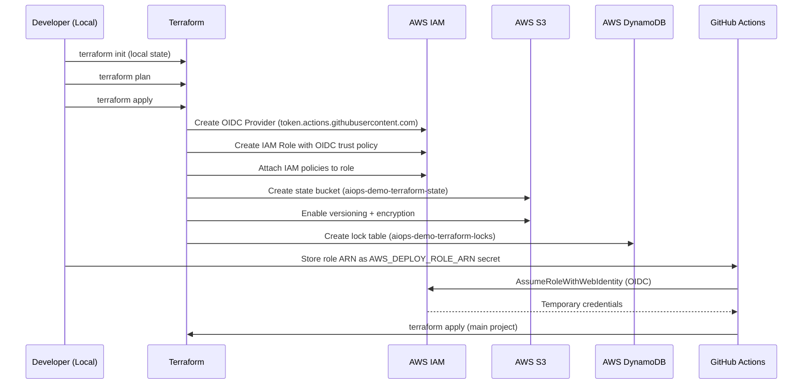

# Design Document: GitHub OIDC Bootstrap

## Overview

This is a standalone Terraform project that bootstraps the foundational AWS infrastructure required before the main AIOps CI/CD pipeline can operate. It creates the GitHub Actions OIDC identity provider, an IAM role with a trust policy scoped to a specific repository/branch, the S3 bucket for Terraform remote state, and the DynamoDB table for state locking. This project is deployed manually (from a local machine) as a one-time prerequisite.

## Main Algorithm/Workflow



## Core Interfaces/Types

### Variables

```hcl
# variables.tf

variable "aws_region" {
  type        = string
  description = "AWS region for all resources"
  default     = "us-east-1"
}

variable "project_name" {
  type        = string
  description = "Project name used for resource naming"
  default     = "aiops-demo"
}

variable "github_org" {
  type        = string
  description = "GitHub organization or username"
}

variable "github_repo" {
  type        = string
  description = "GitHub repository name (without org prefix)"
}

variable "github_branch" {
  type        = string
  description = "Branch allowed to assume the deploy role"
  default     = "release"
}

variable "state_bucket_name" {
  type        = string
  description = "S3 bucket name for the main project's Terraform state"
  default     = "aiops-demo-terraform-state"
}

variable "state_lock_table_name" {
  type        = string
  description = "DynamoDB table name for the main project's state locking"
  default     = "aiops-demo-terraform-locks"
}

variable "tags" {
  type        = map(string)
  description = "Common tags for all resources"
  default = {
    Project   = "aiops-demo"
    ManagedBy = "terraform"
    Component = "oidc-bootstrap"
  }
}
```

### Outputs

```hcl
# outputs.tf

output "oidc_provider_arn" {
  description = "ARN of the GitHub Actions OIDC provider"
  value       = aws_iam_openid_connect_provider.github.arn
}

output "deploy_role_arn" {
  description = "ARN of the IAM role for GitHub Actions (set as AWS_DEPLOY_ROLE_ARN secret)"
  value       = aws_iam_role.github_actions.arn
}

output "deploy_role_name" {
  description = "Name of the IAM role for GitHub Actions"
  value       = aws_iam_role.github_actions.name
}

output "state_bucket_name" {
  description = "S3 bucket name for Terraform remote state"
  value       = aws_s3_bucket.terraform_state.id
}

output "state_bucket_arn" {
  description = "S3 bucket ARN for Terraform remote state"
  value       = aws_s3_bucket.terraform_state.arn
}

output "state_lock_table_name" {
  description = "DynamoDB table name for Terraform state locking"
  value       = aws_dynamodb_table.terraform_locks.name
}

output "state_lock_table_arn" {
  description = "DynamoDB table ARN for Terraform state locking"
  value       = aws_dynamodb_table.terraform_locks.arn
}
```

### Provider and Terraform Configuration

```hcl
# providers.tf

terraform {
  required_version = ">= 1.7.0"

  required_providers {
    aws = {
      source  = "hashicorp/aws"
      version = "~> 5.0"
    }
  }

  # This bootstrap project uses LOCAL state intentionally.
  # It must exist before the S3 backend is available.
  # State file should be committed or stored securely.
}

provider "aws" {
  region = var.aws_region

  default_tags {
    tags = var.tags
  }
}
```

## Key Functions with Formal Specifications

### Resource 1: GitHub Actions OIDC Provider

```hcl
# main.tf — OIDC Identity Provider

data "tls_certificate" "github" {
  url = "https://token.actions.githubusercontent.com/.well-known/openid-configuration"
}

resource "aws_iam_openid_connect_provider" "github" {
  url             = "https://token.actions.githubusercontent.com"
  client_id_list  = ["sts.amazonaws.com"]
  thumbprint_list = [data.tls_certificate.github.certificates[0].sha1_fingerprint]

  tags = merge(var.tags, {
    Name = "${var.project_name}-github-oidc"
  })
}
```

**Preconditions:**
- AWS account does not already have an OIDC provider for `token.actions.githubusercontent.com` (one per account)
- Network access to GitHub's OIDC discovery endpoint is available during plan/apply

**Postconditions:**
- OIDC provider is registered in IAM with audience `sts.amazonaws.com`
- Thumbprint matches GitHub's current TLS certificate
- Provider ARN follows format `arn:aws:iam::{account_id}:oidc-provider/token.actions.githubusercontent.com`

### Resource 2: IAM Role with OIDC Trust Policy

```hcl
# main.tf — IAM Role for GitHub Actions

resource "aws_iam_role" "github_actions" {
  name = "${var.project_name}-github-actions-role"

  assume_role_policy = jsonencode({
    Version = "2012-10-17"
    Statement = [
      {
        Effect = "Allow"
        Principal = {
          Federated = aws_iam_openid_connect_provider.github.arn
        }
        Action = "sts:AssumeRoleWithWebIdentity"
        Condition = {
          StringEquals = {
            "token.actions.githubusercontent.com:aud" = "sts.amazonaws.com"
          }
          StringLike = {
            "token.actions.githubusercontent.com:sub" = "repo:${var.github_org}/${var.github_repo}:ref:refs/heads/${var.github_branch}"
          }
        }
      }
    ]
  })

  tags = merge(var.tags, {
    Name = "${var.project_name}-github-actions-role"
  })
}
```

**Preconditions:**
- `var.github_org` and `var.github_repo` are valid, non-empty strings
- `var.github_branch` matches the branch that will trigger deployments
- OIDC provider resource exists (Terraform handles dependency)

**Postconditions:**
- Role can only be assumed via `sts:AssumeRoleWithWebIdentity`
- Trust policy is scoped to the exact repository and branch — no other repo or branch can assume this role
- Audience condition ensures only GitHub Actions tokens (with `sts.amazonaws.com` audience) are accepted

### Resource 3: IAM Policies for Infrastructure Deployment

```hcl
# iam_policies.tf — Policies attached to the GitHub Actions role

# Policy 1: Terraform state access (S3 + DynamoDB)
resource "aws_iam_policy" "terraform_state" {
  name        = "${var.project_name}-terraform-state-access"
  description = "Allow access to Terraform state bucket and lock table"

  policy = jsonencode({
    Version = "2012-10-17"
    Statement = [
      {
        Sid    = "S3StateAccess"
        Effect = "Allow"
        Action = [
          "s3:GetObject",
          "s3:PutObject",
          "s3:DeleteObject",
          "s3:ListBucket",
        ]
        Resource = [
          aws_s3_bucket.terraform_state.arn,
          "${aws_s3_bucket.terraform_state.arn}/*",
        ]
      },
      {
        Sid    = "DynamoDBLockAccess"
        Effect = "Allow"
        Action = [
          "dynamodb:GetItem",
          "dynamodb:PutItem",
          "dynamodb:DeleteItem",
        ]
        Resource = aws_dynamodb_table.terraform_locks.arn
      }
    ]
  })

  tags = var.tags
}

# Policy 2: Infrastructure deployment permissions
resource "aws_iam_policy" "infra_deploy" {
  name        = "${var.project_name}-infra-deploy"
  description = "Permissions for deploying the main AIOps infrastructure"

  policy = jsonencode({
    Version = "2012-10-17"
    Statement = [
      {
        Sid    = "VPCNetworking"
        Effect = "Allow"
        Action = [
          "ec2:CreateVpc", "ec2:DeleteVpc", "ec2:DescribeVpcs", "ec2:ModifyVpcAttribute",
          "ec2:CreateSubnet", "ec2:DeleteSubnet", "ec2:DescribeSubnets",
          "ec2:CreateInternetGateway", "ec2:DeleteInternetGateway", "ec2:AttachInternetGateway", "ec2:DetachInternetGateway", "ec2:DescribeInternetGateways",
          "ec2:CreateNatGateway", "ec2:DeleteNatGateway", "ec2:DescribeNatGateways",
          "ec2:AllocateAddress", "ec2:ReleaseAddress", "ec2:DescribeAddresses",
          "ec2:CreateRouteTable", "ec2:DeleteRouteTable", "ec2:CreateRoute", "ec2:DeleteRoute", "ec2:AssociateRouteTable", "ec2:DisassociateRouteTable", "ec2:DescribeRouteTables",
          "ec2:CreateSecurityGroup", "ec2:DeleteSecurityGroup", "ec2:AuthorizeSecurityGroupIngress", "ec2:AuthorizeSecurityGroupEgress", "ec2:RevokeSecurityGroupIngress", "ec2:RevokeSecurityGroupEgress", "ec2:DescribeSecurityGroups", "ec2:DescribeSecurityGroupRules",
          "ec2:CreateTags", "ec2:DeleteTags", "ec2:DescribeTags",
          "ec2:DescribeAvailabilityZones", "ec2:DescribeAccountAttributes",
          "ec2:DescribeNetworkInterfaces", "ec2:CreateNetworkInterface", "ec2:DeleteNetworkInterface",
        ]
        Resource = "*"
      },
      {
        Sid    = "EC2Instances"
        Effect = "Allow"
        Action = [
          "ec2:RunInstances", "ec2:TerminateInstances", "ec2:DescribeInstances", "ec2:DescribeInstanceStatus",
          "ec2:DescribeImages", "ec2:DescribeKeyPairs",
          "ec2:DescribeInstanceTypes",
        ]
        Resource = "*"
      },
      {
        Sid    = "EKS"
        Effect = "Allow"
        Action = [
          "eks:CreateCluster", "eks:DeleteCluster", "eks:DescribeCluster", "eks:UpdateClusterConfig", "eks:UpdateClusterVersion",
          "eks:CreateNodegroup", "eks:DeleteNodegroup", "eks:DescribeNodegroup", "eks:UpdateNodegroupConfig",
          "eks:TagResource", "eks:UntagResource", "eks:ListClusters", "eks:ListNodegroups",
          "eks:CreateAccessEntry", "eks:DeleteAccessEntry", "eks:DescribeAccessEntry", "eks:ListAccessEntries",
          "eks:AssociateAccessPolicy", "eks:DisassociateAccessPolicy", "eks:ListAssociatedAccessPolicies",
        ]
        Resource = "*"
      },
      {
        Sid    = "ECSFargate"
        Effect = "Allow"
        Action = [
          "ecs:CreateCluster", "ecs:DeleteCluster", "ecs:DescribeClusters",
          "ecs:CreateService", "ecs:DeleteService", "ecs:DescribeServices", "ecs:UpdateService",
          "ecs:RegisterTaskDefinition", "ecs:DeregisterTaskDefinition", "ecs:DescribeTaskDefinition", "ecs:ListTaskDefinitions",
          "ecs:TagResource", "ecs:UntagResource",
          "ecs:PutClusterCapacityProviders",
        ]
        Resource = "*"
      },
      {
        Sid    = "Lambda"
        Effect = "Allow"
        Action = [
          "lambda:CreateFunction", "lambda:DeleteFunction", "lambda:GetFunction", "lambda:UpdateFunctionCode", "lambda:UpdateFunctionConfiguration",
          "lambda:GetFunctionConfiguration", "lambda:ListFunctions",
          "lambda:AddPermission", "lambda:RemovePermission", "lambda:GetPolicy",
          "lambda:TagResource", "lambda:UntagResource", "lambda:ListTags",
        ]
        Resource = "*"
      },
      {
        Sid    = "IAMRolesAndPolicies"
        Effect = "Allow"
        Action = [
          "iam:CreateRole", "iam:DeleteRole", "iam:GetRole", "iam:UpdateRole", "iam:ListRoles",
          "iam:AttachRolePolicy", "iam:DetachRolePolicy", "iam:ListAttachedRolePolicies",
          "iam:PutRolePolicy", "iam:DeleteRolePolicy", "iam:GetRolePolicy", "iam:ListRolePolicies",
          "iam:CreatePolicy", "iam:DeletePolicy", "iam:GetPolicy", "iam:GetPolicyVersion", "iam:ListPolicyVersions", "iam:CreatePolicyVersion", "iam:DeletePolicyVersion",
          "iam:CreateInstanceProfile", "iam:DeleteInstanceProfile", "iam:GetInstanceProfile", "iam:AddRoleToInstanceProfile", "iam:RemoveRoleFromInstanceProfile",
          "iam:PassRole",
          "iam:TagRole", "iam:UntagRole", "iam:TagPolicy", "iam:UntagPolicy",
          "iam:CreateServiceLinkedRole",
          "iam:ListInstanceProfilesForRole",
        ]
        Resource = "*"
      },
      {
        Sid    = "LoadBalancing"
        Effect = "Allow"
        Action = [
          "elasticloadbalancing:CreateLoadBalancer", "elasticloadbalancing:DeleteLoadBalancer", "elasticloadbalancing:DescribeLoadBalancers", "elasticloadbalancing:ModifyLoadBalancerAttributes", "elasticloadbalancing:DescribeLoadBalancerAttributes",
          "elasticloadbalancing:CreateTargetGroup", "elasticloadbalancing:DeleteTargetGroup", "elasticloadbalancing:DescribeTargetGroups", "elasticloadbalancing:ModifyTargetGroupAttributes", "elasticloadbalancing:DescribeTargetGroupAttributes",
          "elasticloadbalancing:CreateListener", "elasticloadbalancing:DeleteListener", "elasticloadbalancing:DescribeListeners",
          "elasticloadbalancing:RegisterTargets", "elasticloadbalancing:DeregisterTargets", "elasticloadbalancing:DescribeTargetHealth",
          "elasticloadbalancing:AddTags", "elasticloadbalancing:RemoveTags", "elasticloadbalancing:DescribeTags",
        ]
        Resource = "*"
      },
      {
        Sid    = "CloudWatchLogs"
        Effect = "Allow"
        Action = [
          "logs:CreateLogGroup", "logs:DeleteLogGroup", "logs:DescribeLogGroups",
          "logs:PutRetentionPolicy", "logs:DeleteRetentionPolicy",
          "logs:TagLogGroup", "logs:UntagLogGroup",
          "logs:TagResource", "logs:UntagResource", "logs:ListTagsForResource", "logs:ListTagsLogGroup",
        ]
        Resource = "*"
      },
    ]
  })

  tags = var.tags
}

# Attach policies to the role
resource "aws_iam_role_policy_attachment" "terraform_state" {
  role       = aws_iam_role.github_actions.name
  policy_arn = aws_iam_policy.terraform_state.arn
}

resource "aws_iam_role_policy_attachment" "infra_deploy" {
  role       = aws_iam_role.github_actions.name
  policy_arn = aws_iam_policy.infra_deploy.arn
}
```

**Preconditions:**
- IAM role `github_actions` exists (Terraform handles dependency)
- S3 bucket and DynamoDB table resources are defined (for ARN references in state policy)

**Postconditions:**
- Two custom policies are created and attached to the role
- `terraform_state` policy grants S3 and DynamoDB access scoped to the specific state resources
- `infra_deploy` policy grants permissions for VPC, EC2, EKS, ECS, Lambda, IAM, ALB, and CloudWatch Logs
- No `*` actions are used — all permissions are explicitly enumerated
- The role has sufficient permissions to deploy the full AIOps infrastructure

**Loop Invariants:** N/A

### Resource 4: S3 Bucket for Terraform State

```hcl
# state_backend.tf — S3 bucket for the main project's remote state

resource "aws_s3_bucket" "terraform_state" {
  bucket = var.state_bucket_name

  # Prevent accidental deletion of this critical bucket
  lifecycle {
    prevent_destroy = true
  }

  tags = merge(var.tags, {
    Name = var.state_bucket_name
  })
}

resource "aws_s3_bucket_versioning" "terraform_state" {
  bucket = aws_s3_bucket.terraform_state.id

  versioning_configuration {
    status = "Enabled"
  }
}

resource "aws_s3_bucket_server_side_encryption_configuration" "terraform_state" {
  bucket = aws_s3_bucket.terraform_state.id

  rule {
    apply_server_side_encryption_by_default {
      sse_algorithm = "aws:kms"
    }
    bucket_key_enabled = true
  }
}

resource "aws_s3_bucket_public_access_block" "terraform_state" {
  bucket = aws_s3_bucket.terraform_state.id

  block_public_acls       = true
  block_public_policy     = true
  ignore_public_acls      = true
  restrict_public_buckets = true
}
```

**Preconditions:**
- `var.state_bucket_name` is globally unique across all AWS accounts
- No existing S3 bucket with the same name exists

**Postconditions:**
- Bucket is created with versioning enabled (supports state rollback)
- Server-side encryption is enabled with AWS KMS
- All public access is blocked (4 public access block settings)
- `prevent_destroy` lifecycle rule protects against accidental deletion
- Bucket is tagged with project metadata

### Resource 5: DynamoDB Table for State Locking

```hcl
# state_backend.tf — DynamoDB table for Terraform state locking

resource "aws_dynamodb_table" "terraform_locks" {
  name         = var.state_lock_table_name
  billing_mode = "PAY_PER_REQUEST"
  hash_key     = "LockID"

  attribute {
    name = "LockID"
    type = "S"
  }

  # Prevent accidental deletion
  lifecycle {
    prevent_destroy = true
  }

  tags = merge(var.tags, {
    Name = var.state_lock_table_name
  })
}
```

**Preconditions:**
- `var.state_lock_table_name` is unique within the AWS account and region
- No existing DynamoDB table with the same name exists

**Postconditions:**
- Table is created with `LockID` as the partition key (type String) — required by Terraform's S3 backend
- Billing mode is PAY_PER_REQUEST (no capacity planning needed for infrequent lock operations)
- `prevent_destroy` lifecycle rule protects against accidental deletion
- Table is tagged with project metadata

## Example Usage

### Deploying the Bootstrap Project

```hcl
# terraform.tfvars — Example configuration

aws_region    = "us-east-1"
project_name  = "aiops-demo"
github_org    = "your-github-org"
github_repo   = "your-repo-name"
github_branch = "release"

state_bucket_name     = "aiops-demo-terraform-state"
state_lock_table_name = "aiops-demo-terraform-locks"

tags = {
  Project     = "aiops-demo"
  ManagedBy   = "terraform"
  Component   = "oidc-bootstrap"
  Environment = "shared"
}
```

```bash
# Step 1: Initialize (local state — no backend needed)
terraform init

# Step 2: Review the plan
terraform plan -var="github_org=your-github-org" -var="github_repo=your-repo-name"

# Step 3: Apply
terraform apply -var="github_org=your-github-org" -var="github_repo=your-repo-name"

# Step 4: Note the outputs
# deploy_role_arn = "arn:aws:iam::123456789012:role/aiops-demo-github-actions-role"
# → Store this as the GitHub secret AWS_DEPLOY_ROLE_ARN

# Step 5: Verify the main project can now use the backend
# In the main project's backend.tf:
#   bucket         = "aiops-demo-terraform-state"
#   dynamodb_table = "aiops-demo-terraform-locks"
```

### Project File Structure

```
github-oidc-bootstrap/
├── providers.tf          # Terraform + AWS provider config (local state)
├── variables.tf          # All input variables
├── main.tf               # OIDC provider + IAM role
├── iam_policies.tf       # IAM policies for the deploy role
├── state_backend.tf      # S3 bucket + DynamoDB table
├── outputs.tf            # All outputs (role ARN, bucket name, etc.)
├── terraform.tfvars      # Default variable values
└── README.md             # Usage instructions
```

## Correctness Properties

```hcl
# Property 1: OIDC provider URL is exactly the GitHub Actions token endpoint
# ∀ provider ∈ oidc_providers:
#   provider.url == "https://token.actions.githubusercontent.com"

# Property 2: Trust policy restricts to exact repo and branch
# ∀ role ∈ github_actions_roles:
#   role.trust_policy.condition.sub MATCHES "repo:{org}/{repo}:ref:refs/heads/{branch}"
#   ∧ role.trust_policy.action == "sts:AssumeRoleWithWebIdentity"

# Property 3: S3 state bucket has all security controls enabled
# ∀ bucket ∈ state_buckets:
#   bucket.versioning == "Enabled"
#   ∧ bucket.encryption.algorithm ∈ {"aws:kms", "AES256"}
#   ∧ bucket.public_access_block.block_public_acls == true
#   ∧ bucket.public_access_block.block_public_policy == true
#   ∧ bucket.public_access_block.ignore_public_acls == true
#   ∧ bucket.public_access_block.restrict_public_buckets == true

# Property 4: DynamoDB lock table has correct schema
# ∀ table ∈ lock_tables:
#   table.hash_key == "LockID"
#   ∧ table.hash_key_type == "S"

# Property 5: IAM policies use explicit actions (no wildcards in Action)
# ∀ policy ∈ iam_policies:
#   ∀ statement ∈ policy.statements:
#     ¬ ("*" ∈ statement.actions)

# Property 6: State resources have prevent_destroy lifecycle
# ∀ resource ∈ {state_bucket, lock_table}:
#   resource.lifecycle.prevent_destroy == true

# Property 7: Deploy role has sufficient permissions for main project
# ∀ role ∈ deploy_roles:
#   role.policies COVERS {"ec2:*vpc*", "eks:*", "ecs:*", "lambda:*", "iam:*role*", "s3:*state*", "dynamodb:*lock*"}

# Property 8: Bootstrap project uses local state (no remote backend)
# terraform.backend == "local"
#   (The bootstrap must be deployable before any remote backend exists)
```
