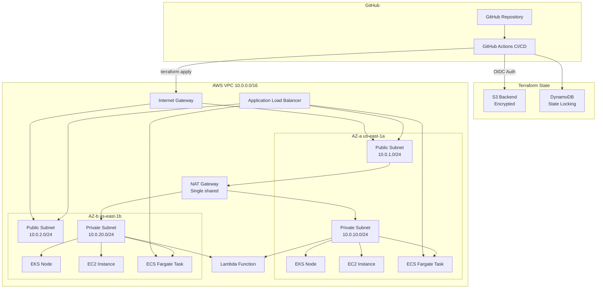
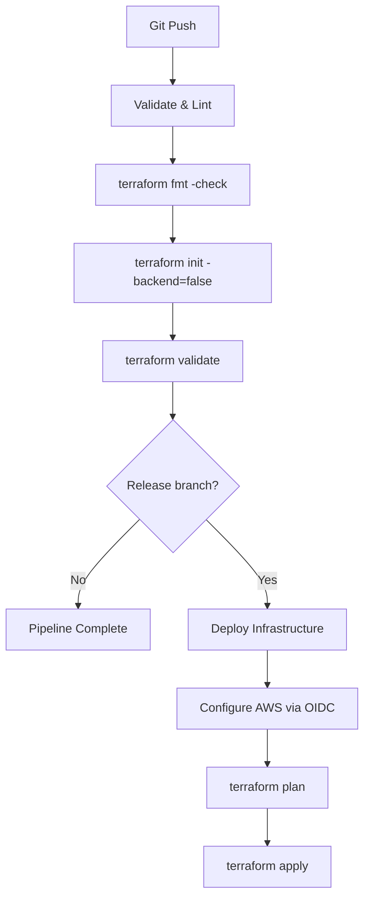

# Architecture — AIOps Demo Infrastructure

## System Overview

The AIOps demo infrastructure provisions a multi-service AWS environment using Terraform. All compute workloads run inside a shared VPC distributed across two Availability Zones for high availability. The stack includes:

- **VPC** with public and private subnets, internet gateway, and a single shared NAT gateway
- **EKS** managed Kubernetes cluster with node groups in private subnets
- **EC2** instances distributed across private subnets with IAM instance profiles
- **ECS Fargate** cluster with an Application Load Balancer in public subnets
- **Lambda** function attached to VPC private subnets

A GitHub Actions CI/CD pipeline validates, scans, and deploys the infrastructure. Authentication to AWS uses GitHub OIDC — no long-lived credentials are stored.

## Architecture Diagram

## Module Descriptions

### VPC (`terraform-aws-modules/vpc/aws ~> 5.0`)

Provisions the shared networking foundation. Creates a VPC with DNS support, public and private subnets across two AZs, an internet gateway, and a single shared NAT gateway. Public subnets route outbound traffic through the internet gateway. Private subnets route outbound traffic through the shared NAT gateway.

**Key resources:** VPC, public subnets, private subnets, internet gateway, NAT gateway, Elastic IP, route tables.

### EKS (`terraform-aws-modules/eks/aws ~> 20.0`)

Deploys an Amazon EKS cluster with a managed node group. The cluster control plane and nodes run in private subnets. Cluster logging is enabled for audit, API, and authenticator events. Node group scaling is configurable via min/max/desired size variables.

**Key resources:** EKS cluster, managed node group, IAM roles, security groups, CloudWatch log groups.

### EC2 (`./modules/ec2`)

Provisions EC2 instances distributed across private subnets using modular index assignment (`count.index % length(subnet_ids)`). Each instance has an IAM instance profile with SSM access and a security group that restricts SSH ingress to the VPC CIDR. IMDSv2 is enforced and root volumes are encrypted.

**Key resources:** EC2 instances, security group, IAM role, IAM instance profile.

### ECS (`./modules/ecs`)

Runs containerized workloads on ECS Fargate. The cluster uses the Fargate capacity provider. Tasks run in private subnets and are fronted by an Application Load Balancer in public subnets. Container logs are sent to CloudWatch. The ALB performs HTTP health checks against the target group.

**Key resources:** ECS cluster, task definition, ECS service, ALB, target group, listener, security groups, IAM task execution role, CloudWatch log group.

### Lambda (`./modules/lambda`)

Deploys a VPC-attached Lambda function in private subnets. The function has its own security group (egress-only) and an IAM execution role with basic execution and VPC access policies. Source code is packaged from `modules/lambda/src/` and CloudWatch log retention is set to 14 days.

**Key resources:** Lambda function, IAM role, security group, CloudWatch log group.

## CI/CD Pipeline Overview

The GitHub Actions workflow (`.github/workflows/terraform.yml`) runs on every push to any branch:

- **All branches:** Format check, init (no backend), and validate.
- **Release branch only:** Full deploy with AWS OIDC authentication, plan, and apply.
- The `production` GitHub environment can be configured with required reviewers for manual approval before apply.

## Security Model

### Authentication

- **GitHub OIDC:** GitHub Actions authenticates to AWS using short-lived OIDC tokens. The IAM role trust policy is scoped to a specific repository and branch. No long-lived AWS credentials are stored in GitHub secrets.
- The OIDC provider and deploy role are bootstrapped separately via `init/github/tf/`.

### Network Security

- **Private subnets:** All compute resources (EKS nodes, EC2 instances, ECS tasks, Lambda) run in private subnets with no direct internet access.
- **NAT egress only:** Private subnet resources reach the internet through a single shared NAT gateway (outbound only).
- **Security groups:** Default deny-all with explicit allow rules. Only the ECS ALB security group allows inbound HTTP (port 80) from the internet. EC2 SSH is restricted to the VPC CIDR.

### IAM — Least Privilege

- Each service has its own IAM role with only the permissions it needs:
  - **EKS:** Cluster role and node group role with AWS-managed EKS policies.
  - **EC2:** Instance profile with SSM managed instance core policy.
  - **ECS:** Task execution role with the ECS task execution policy.
  - **Lambda:** Execution role with basic execution and VPC access policies.

### State Security

- Terraform state is stored in S3 with server-side encryption enabled (`encrypt = true`).
- DynamoDB provides state locking to prevent concurrent modifications.
- The state bucket has versioning enabled and public access blocked.
